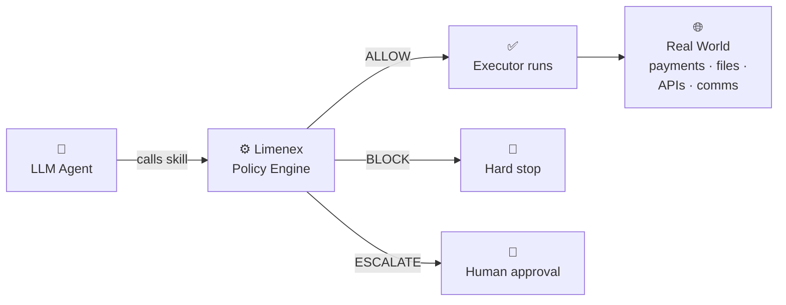

# Limenex
### Deterministic governance for AI agents and agentic systems

The safety instructions in your agentic system live in the same context window as a prompt injection attack. One of them will win — and it won't always be yours.

Without an enforcement layer outside the model, a single malicious input can drain an account, exfiltrate credentials, or delete production data.

**Limenex** is a deterministic enforcement layer between your agent and the real world. A lightweight policy engine that intercepts every consequential action before execution — blocking, escalating, or allowing it based on rules the model cannot override.

Wire it once at startup. Zero changes to your agent logic or executors.

```python
# Limenex-governed skill — wired once at startup
charge = make_charge(policy_engine)

# Pass your executor — Limenex decides if it runs
await charge(
    agent_id="agent-1", amount=49.99, currency="USD", executor=charge_customer
)
```
### How it works
AI agents are like employees at your organisation. They can think and innovate freely — but policies draw the line between what they can execute unilaterally and what requires sign-off. That's exactly how Limenex works: what actions are allowed, what requires human approval, and what is never permitted — defined in config, not in a prompt.


### Verdicts — ALLOW, BLOCK, or ESCALATE
Every governed action produces exactly one of three verdicts:

- **ALLOW** — the action proceeds immediately, no intervention
- **BLOCK** — the action is hard-stopped, no override possible
- **ESCALATE** — the action is paused and routed to a human approver

The distinction between BLOCK and ESCALATE is intentional. Some limits should never be overridden — a hard no, regardless of context. Others represent a threshold where human judgment is appropriate, not a hard prohibition. You choose the verdict per rule, per skill.

### Policies — deterministic or semantic

Policies are defined as an ordered list and evaluated in sequence — the engine short-circuits on the first breach. Each policy produces one of the three verdicts above.

**Deterministic policies** are hard, rule-based checks evaluated against cumulative state — block if spend in the last 4 hours exceeds $50, escalate if a write targets a protected directory.

**Semantic policies** are natural language rules evaluated by a separate LLM you provide — "Escalate if the email tone appears aggressive." Same verdict system. No hidden calls. Your model, your rules.

### Skills — only those that matter

A skill is a governed wrapper around a single consequential action — charging a payment, writing a file, sending a message. Not every function call needs one. Only the ones that carry real risk.

Skills are vendor-agnostic: `filesystem.write` is named after what it does, not which library executes it. You inject the executor; Limenex governs whether it runs.
