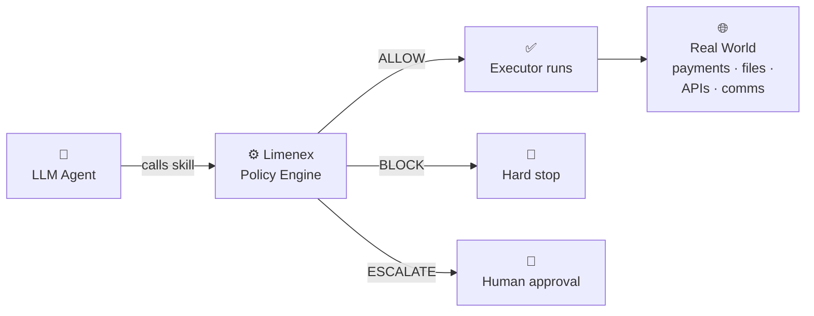

# Limenex
### Deterministic governance for AI agents and agentic systems

The safety instructions in your agentic system live in the same context window as a prompt injection attack. One of them will win — and it won't always be yours.

Without an enforcement layer outside the model, a single malicious input can drain an account, exfiltrate credentials, or delete production data.

**Limenex** is a deterministic enforcement layer between your agent and the real world. A lightweight policy engine that intercepts every consequential action before execution — blocking, escalating, or allowing it based on rules the model cannot override.

Wire it once at startup. Zero changes to your agent logic or executors.

```python
# Wire once at startup — executor registry is invisible to the agent
charge = make_charge(
    policy_engine,
    registry={
        "stripe": charge_via_stripe,
        "square": charge_via_square,
    }
)

# Agent expresses intent in plain data — no executor knowledge required
await charge(agent_id="agent-1", provider="stripe", amount=49.99, currency="USD")
```
### How it works
AI agents are like employees at your organisation. They can think and innovate freely — but policies draw the line between what they can execute unilaterally and what requires sign-off. That's exactly how Limenex works: what actions are allowed, what requires human approval, and what is never permitted — defined in config, not in a prompt.


### Verdicts — ALLOW, BLOCK, or ESCALATE
Every governed action produces exactly one of three verdicts:

- **ALLOW** — the action proceeds immediately, no intervention
- **BLOCK** — the action is hard-stopped, no override possible
- **ESCALATE** — the action is paused and routed to a human approver

The distinction between BLOCK and ESCALATE is intentional. Some limits should never be overridden — a hard no, regardless of context. Others represent a threshold where human judgment is appropriate, not a hard prohibition. You choose the verdict per rule, per skill.

### Policies — deterministic or semantic

Policies are defined as an ordered list and evaluated in sequence — the engine short-circuits on the first breach. Each policy produces one of the three verdicts above.

**Deterministic policies** are hard, rule-based checks — cumulative (block if total spend exceeds \$50), per-call (block if a single charge exceeds \$500), or set-based (escalate if a write targets a protected directory).

**Semantic policies** are natural language rules evaluated by a separate LLM you provide — "Escalate if the email tone appears aggressive." Same verdict system. No hidden calls. Your model, your rules.

### Skills — only those that matter

A skill is a governed wrapper around a single consequential action — charging a payment, writing a file, sending a message. Not every function call needs one. Only the ones that carry real risk.

Skills are vendor-agnostic: `filesystem.write` is named after what it does, not which library executes it. You inject the executor; Limenex governs whether it runs.

---
## Quickstart

Install Limenex:

```bash
pip install limenex
```

Create `.limenex/policies.yaml`:

```yaml
finance.spend:
  policies:
    - type: deterministic
      dimension: spend_usd
      operator: lt
      value: 50.0
      param: amount_usd
      breach_verdict: ESCALATE
```

Wire up the skill at application startup:

```python
import asyncio
from limenex.core.engine import PolicyEngine, EscalationRequired
from limenex.core.policy_store import LocalFilePolicyStore
from limenex.core.stores import LocalFileStateStore
from limenex.skills.finance import make_spend

policy_store = LocalFilePolicyStore(".limenex/policies.yaml")
state_store  = LocalFileStateStore(".limenex/state.json")
engine       = PolicyEngine(
    policy_store=policy_store, 
    state_store=state_store,
)

# Your payment executor — injected once at startup
async def my_payment_executor(amount_usd: float):
    print(f"Payment of ${amount_usd:.2f} sent")

spend = make_spend(
    engine, 
    registry={
        "acme-payments": my_payment_executor,
    }
)

# Expose to your LLM agent as a tool — plain data parameters only:
# spend(service: str, amount_usd: float)

async def main():
    try:
        await spend(agent_id="agent-1", service="acme-payments", amount_usd=30.0)   # ✓ runs
        await spend(agent_id="agent-1", service="acme-payments", amount_usd=30.0)   # ✗ escalates
    except EscalationRequired:
        print("Action paused — agent-1 has hit the spend limit.")

asyncio.run(main())
```

The first call executes and Limenex records `$30` against `agent-1` in `.limenex/state.json`. The second call never reaches the executor — the engine evaluates `$30 (recorded) + $30 (proposed) = $60`, sees it would breach the `< $50` limit, and raises `EscalationRequired` before execution.

Open `.limenex/state.json` to inspect recorded state at any time:

```json
{
  "spend_usd": {
    "agent-1": 30.0
  }
}
```

> For a full worked example — agent intent, escalation handling, approval loop, and integration with LangGraph — see [`examples/langgraph_example.ipynb`](https://github.com/limenex-hq/limenex/tree/main/examples).
 
---
## Contributing

We welcome contributions — see [CONTRIBUTING.md](contributing.md) for guidelines.

## License

Limenex is licensed under the [MIT License](https://github.com/limenex-hq/limenex).
